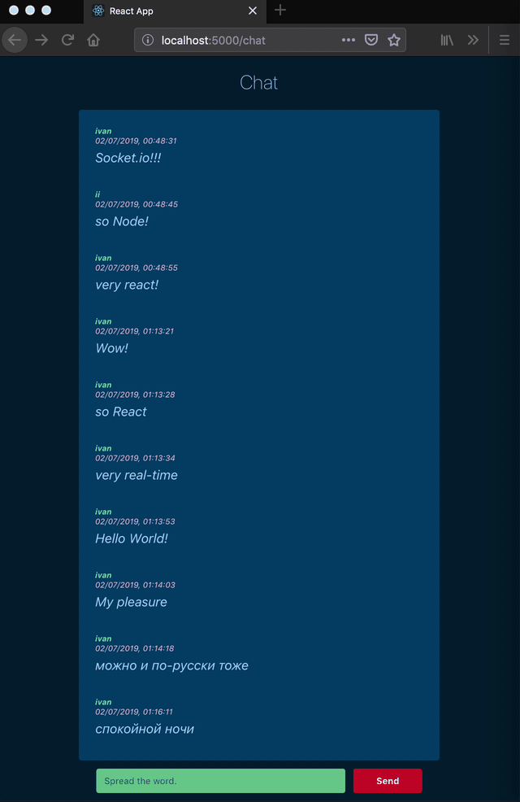

### Chat app front-end

Utilizes [Node.js RESTful API](https://github.com/antevis/chat_backend) + Socket.io for real-time messages feed updates.

usage:

* `npm start`: Runs the app in the development mode.

serve it with a static server:

* `npm install -g serve`
* `serve -s build`

The feed will get populated with the latest 10 available messages.

